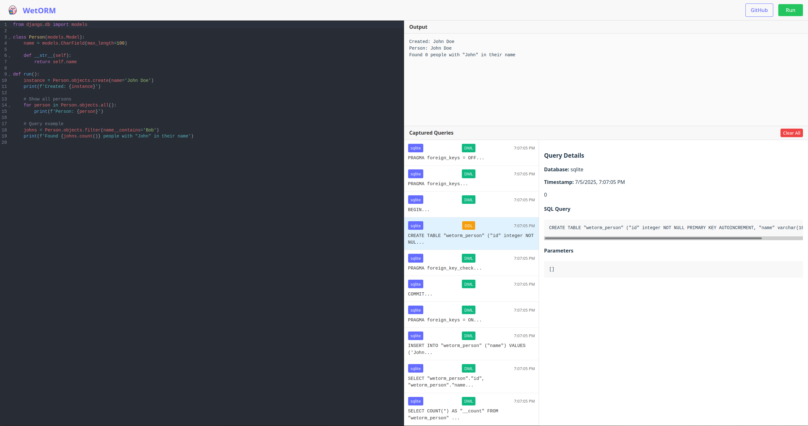

# WetORM

<div align="center">
  
  
  **Django ORM Query Analyzer in the Browser**
  
  Run Django ORM code and visualize the generated SQL queries in real-time.
</div>



## Features

- **Browser-based Django ORM**: Run Django models and queries directly in your browser using Pyodide
- **Real-time Query Capture**: See every SQL query generated by the Django ORM as you write code
- **DDL & DML Query Types**: Automatically categorizes CREATE TABLE statements vs data manipulation queries
- **Code Sharing**: Share your Django examples via GitHub Gist URLs
- **Zero Setup**: No installation required - everything runs in the browser
- **Syntax Highlighting**: Python code editor with syntax highlighting and auto-completion
- **100% client-side**: Your code never leaves your browser

For a more feature-complete option, check out xterm's [DryORM][], which
inspired this fun weekend project.

## Usage

1. **Write Django Models**: Define your Django models in the code editor
2. **Create a `run()` function**: Put your ORM queries inside this function
3. **Click Run**: Execute your code and see the output plus all generated SQL queries
4. **Share Examples**: Create a GitHub Gist and share via `?gist=GIST_ID` URL parameter

## Development

```bash
npm install
npm run dev
```

### Scripts

- `npm run dev` - Start development server
- `npm run build` - Build for production
- `npm run lint` - Run ESLint
- `npm run format` - Format code with Prettier

## How Does It Work?

WetORM leverages several cutting-edge web technologies to run Django entirely in your browser:

1. **Pyodide**: A Python distribution compiled to WebAssembly that includes Django and SQLite
2. **In-Memory Database**: SQLite runs entirely in browser memory - no server required
3. **Query Interception**: Django's query logging captures every SQL statement executed by the ORM
4. **Real-Time Analysis**: As you write Django code, WetORM automatically:
   - Detects model definitions
   - Creates database tables (DDL queries)
   - Executes your `run()` function
   - Captures and categorizes all resulting SQL queries

The entire process happens client-side with zero server interaction, making it perfect for learning, experimenting, and sharing Django ORM examples.

## License

MIT License - see LICENSE file for details.

[DryORM]: https://github.com/omaraboumrad/dryorm

