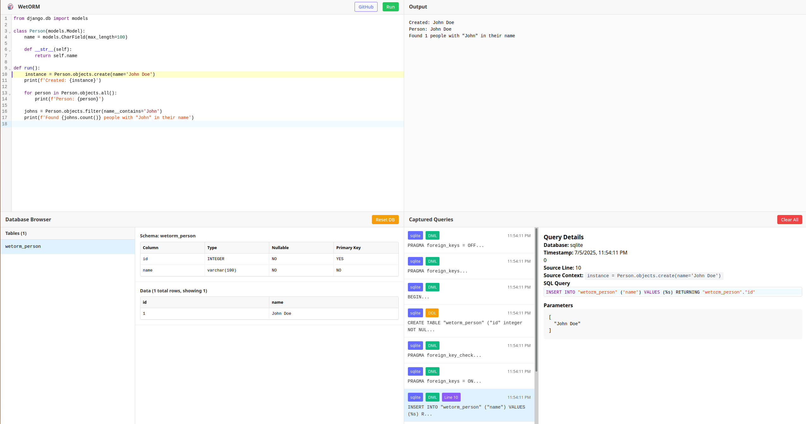

# WetORM

<div align="center">
  
  
  **Django ORM Query Analyzer in the Browser**
  
  Run Django ORM code and visualize the generated SQL queries in real-time.
</div>



## Live

You can try out WetORM for yourself at [https://tkte.ch/wetorm](https://tkte.ch/wetorm).

## Features

- **Browser-based Django ORM**: Run Django models and queries directly in your browser using Pyodide
- **Real-time Query Capture**: See every SQL query generated by the Django ORM as you write code
- **Code Sharing**: Share your Django examples via GitHub Gist URLs
- **Zero Setup**: No installation required - everything runs in the browser
- **Syntax Highlighting**: Python code editor with syntax highlighting and auto-completion
- **100% client-side**: Your code never leaves your browser

For a more feature-complete option, check out xterm's [DryORM][], which
inspired this fun weekend project.

## Development

```bash
npm install
npm run dev
```

### Scripts

- `npm run dev` - Start development server
- `npm run build` - Build for production
- `npm run lint` - Run ESLint
- `npm run format` - Format code with Prettier

## License

MIT License - see LICENSE file for details.

[DryORM]: https://github.com/omaraboumrad/dryorm

